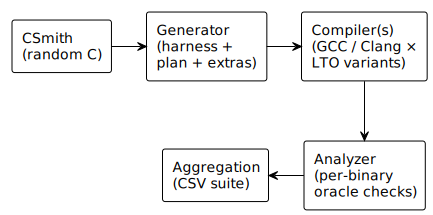
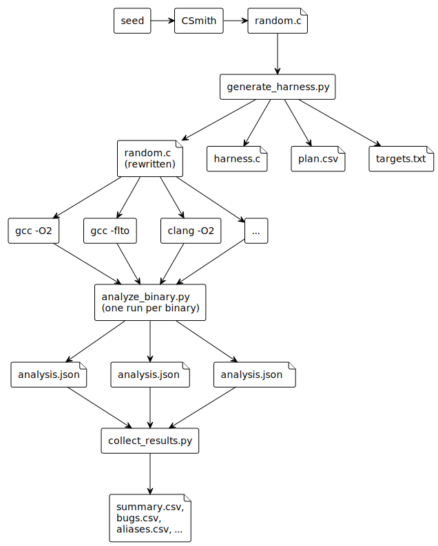

# Architecture

This document describes the system architecture and data flow of the CET/IBT differential testing framework.

## Overview

The framework works in three stages: generate, compile, and analyze. Each stage is separate and communicates through C source code, CSV plans, or JSON reports.

## Components

### 1. Generator
Input: CSmith-generated C source file, random seed.
Output: Rewritten source with IBT attributes, harness C file, CSV test plan, target list.

Tasks:
1. Signature extraction: Scans the CSmith source for prototypes and normalizes them.
2. Target selection: Randomly selects functions and assigns IBT attributes like nocf_check, cf_check, or none.
3. Source rewriting: Injects attributes into the original CSmith source.
4. Harness emission: Generates per-target shim functions containing exactly one indirect call through a function pointer.

### 2. Compiler Configurations
We test five configurations:
- gcc-branch-baseline: GCC with -O2 -fcf-protection=branch
- gcc-branch-lto: GCC as above plus -flto
- clang-branch-baseline: Clang with -O2 -fcf-protection=branch --icf=none
- clang-branch-thinlto: Clang as above plus -flto=thin
- clang-branch-fulllto: Clang as above plus -flto

All Clang configs use lld with --icf=none to prevent identical-code folding of the shim functions.

### 3. Analyzer
Input: Compiled ELF binary, CSV test plan, target list.
Output: JSON report with verdicts and bug records.

Runs four oracles against each binary to verify endbr64 at function entries, notrack prefixes on indirect calls, and jump table behavior.

### 4. Runner
Orchestrates the entire pipeline via shell scripts. It handles preflight checks, CSV initialization, the per-seed loop, aggregating JSON results into CSVs, finding cross-compiler differentials, and displaying results.

## Data Flow

1. A random seed goes into CSmith, producing a random C file.
2. generate_harness.py rewrites the source and creates a harness file, plan CSV, and target list.
3. The source is compiled by different compilers using various LTO configurations.
4. analyze_binary.py analyzes each resulting binary to produce a JSON analysis file.
5. collect_results.py aggregates all JSON files into final CSV results.

## Design Decisions

### Per-Target Shims
Instead of counting notrack calls globally, we create a specific shim function for each target. Every shim contains exactly one indirect call. The analyzer locates this specific call to give a precise verdict.

### Opaque Barriers
Each shim passes its function pointer through an inline-asm identity function with a memory clobber. This stops the compiler from devirtualizing the call, folding call sites together, or propagating pointer constants.

### ICF Limitation
Identical Code Folding on target function bodies is allowed because turning it off would change the tested code. When ICF merges functions, it is documented in aliases.csv and is not treated as a bug.
